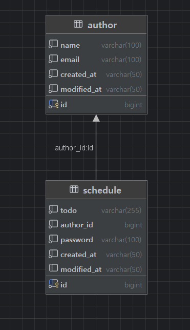

# Schedule Management App

**Spring Boot와 MySQL을 사용한 간단한 일정 관리 웹 프로젝트**

---

## 🗂️ 소개

- 작성자(Author)가 여러 일정(Schedule)을 등록, 수정, 삭제, 조회할 수 있는 웹 백엔드 서버입니다.
- RESTful API 구조를 따릅니다.
- 코드와 DB 레이어 분리, DTO 패턴, Lombok 등 자바 실무에 쓰이는 기술을 반영했습니다.
---

## API 명세서
| 기능       | 메서드    | URI                   | 요청 방식    | 요청 데이터                        | 응답 데이터    | 응답 코드                     |
| -------- | ------ | --------------------- | -------- | ----------------------------- | --------- | ------------------------- |
| 일정 등록    | POST   | `/api/schedules`      | 요청 body  | `title`, `author`, `password` | 등록된 일정 정보 | 201: 생성완료                 |
| 일정 조회    | GET    | `/api/schedules/{id}` | 요청 param | 일정 ID                         | 단건 일정 정보  | 200: 정상조회                 |
| 일정 목록 조회 | GET    | `/api/schedules`      | 요청 param | `author`, `modifiedAt` (선택)   | 일정 리스트 정보 | 200: 정상조회 / 404: id에 맞는 일정이 없을 때 |
| 일정 수정    | PUT    | `/api/schedules/{id}` | 요청 body  | `title`, `author`, `password` | 수정된 일정 정보 | 200: 정상수정 / 400: 비밀번호 불일치 |
| 일정 삭제    | DELETE | `/api/schedules/{id}` | 요청 body  | `password`                    | -         | 204: 정상삭제 / 400: 비밀번호 불일치 |

## ERD

---

## ⚙️ 주요 기술 스택

- Java 17
- Spring Boot 3.x
- Spring MVC
- Spring JDBC
- Lombok
- MySQL 8.x

---

## 🏗️ 프로젝트 구조
com.example.schedulemanagementapp 

├── controller 

├── dto 

├── entity 

├── repository 

├── service 

└── (기타 config/exception 등)

---

## 📝 주요 기능 요약

- **작성자(author) 등록, 조회**
- **일정(schedule) 등록, 목록조회, 단건조회, 수정, 삭제**
- 비밀번호 일치 시에만 수정/삭제 허용

---

## 🖥️ API 사용법 예시

### 1. 일정 등록
POST /schedules Content-Type: application/json { "todo": "할 일 예시", "authorId": 1, "password": "암호" }
### 2. 일정 목록 조회
GET /schedules GET /schedules?author=홍길동&modifiedDate=2024-06-18T14:30:00
### 3. 일정 단건 조회
GET /schedules/{id}
### 4. 일정 수정
PUT /schedules/{id} Content-Type: application/json { "todo": "수정된 할 일", "authorId": 1, "password": "암호" }
### 5. 일정 삭제
DELETE /schedules/{id} Content-Type: application/json { "password": "암호" }

---

## ⚙️ 환경설정

`src/main/resources/application.properties` 참고

properties spring.datasource.url=jdbc:mysql://localhost:3306/schedule?useUnicode=true&characterEncoding=utf8&serverTimezone=Asia/Seoul&useSSL=false spring.datasource.username=your_mysql_username 
spring.datasource.password=your_mysql_password

---

## 💾 데이터베이스 테이블
sql CREATE TABLE author ( 

id BIGINT AUTO_INCREMENT PRIMARY KEY, 

name VARCHAR(100) NOT NULL, 

email VARCHAR(100) NOT NULL, 

created_at VARCHAR(50) NOT NULL, 

modified_at VARCHAR(50) NOT NULL 
);

---

CREATE TABLE schedule ( 

id BIGINT AUTO_INCREMENT PRIMARY KEY,

todo VARCHAR(255) NOT NULL, 

author_id BIGINT NOT NULL, 

password VARCHAR(100) NOT NULL, 

created_at VARCHAR(50) NOT NULL, 

modified_at VARCHAR(50)
);

---

## 🛠️ 빌드 및 실행

1. 자바 17 및 MySQL 설치
2. DB 및 테이블 생성 (위 SQL 활용)
3. `application.properties`에서 DB 정보 변경

---

